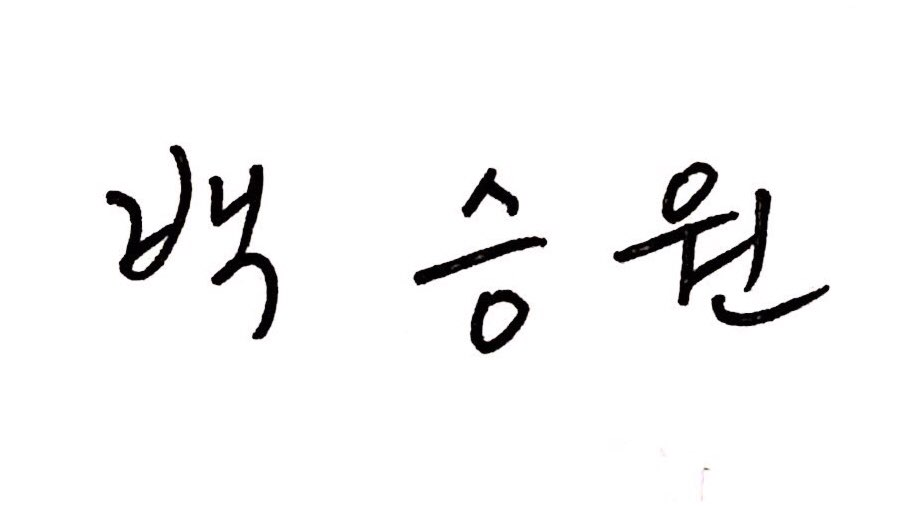

# Backward Detection Model 

[Paper link](https://dl.acm.org/doi/abs/10.1145/3415264.3425469)

> A user’s movement is one of the most important properties that pertain to user experience in a virtual reality (VR) environment. However, little research has focused on examining backward movements. Inappropriate support of such movements could lead to dizziness and disengagement in a VR program. In this paper, we investigate the possibility of detecting forward and backward movements from three different positions of the body (i.e., head, waist, and feet) by conducting a user study. Our machine-learning model yields the detection of forward and backward movements up to 93% accuracy and shows slightly varying performances by the participants. We detail the analysis of our model through the lenses of body position, integration, and sampling rate.

## Contents
- [Contribution 1]() - Unconditional, unfiltered 2048 token samples from GPT-3 with p=.85, t=1.&#12288;  
**CONTENT WARNING:** this is bold
- [Contribution 2]() - Synthetic datasets for word scramble and arithmetic tasks described in the paper.
- [Contribution 3]() - Statistics for all languages included in the training dataset mix.
- [Contribution 4]() - Samples of 13-gram overlaps between our training data and benchmarks, selected by frequency in the training set.
- [Contribution 5]() - GPT-3 Model Card.
